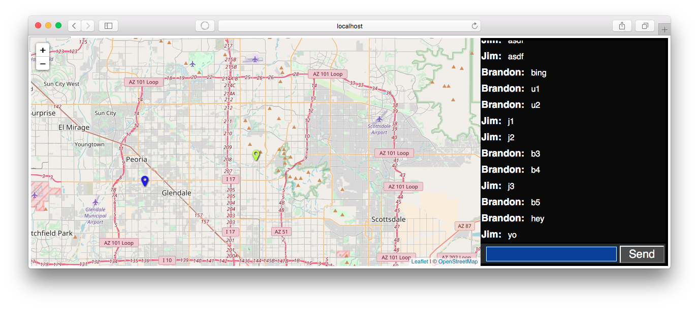

# SwarmTech

Realtime coordination demo for disaster response teams.



## Who

* Grassroots volunteers for disaster response
* Police, Fire, National Guard

## Why

* Teams need to coordinate/share data to avoid wasted effort and be effective
* Volunteer teams may form and disband in a way that cannot be preplanned
* Need decentralized information management in order to take advantage of decentralized network (e.g. mesh)

## What

* Phone app reporting location and allowing text chat (field agents)
* Command center app showing pins for field agents, near-real-time integrated communications and situational awareness
* Ability to merge two teams situational awareness with 0 shared infrastructure and no custom integration costs (assuming protocol compliance)
* Demonstration of capabilities via “disaster drills” and report on outcome

## How

* Near-real-time state synchronization based on CRDTs
* Use data format RFCs when possible (e.g. GeoJSON, jCard)
* Extensible schema-less graph data to express relationships
* Content addressing
* Peer discovery by gossip protocol
* Object capability model for data access control
* Cryptographically verified identity, ownership, access

If you don't understand what these things mean, don't worry, you probably don't have to in order to use it, or even build apps on it.  Keep calm and carry on!

# Contributing

To begin contributing, please fork the repository to your personal account, clone it, and submit a pull request.  We'll respond with comments and should have your patch merged in short order.  If there are any problems with this process, please talk to us on [gitter.im/JSVillage](https://gitter.im/JSVillage).

# Running the project for developers/testers

Basically all we need to do is serve a static site.  If you alreaady know how to do that, feel free to serve the root directory of this project.  Otherwise, keep reading to set up a simple Node.js server.

Open a terminal on Mac or Linux and enter the following commands.  On Windows?  Get [git](https://git-scm.com/downloads) first, then run `git-bash` and do the same.

```
# install nvm
curl -o- https://raw.githubusercontent.com/creationix/nvm/v0.33.8/install.sh | bash

# check for latest version of node
nvm ls-remote

# install, for instance node.js v8.9.4
nvm install v8.9.4

# install parcel build tool
npm install -g parcel-bundler

```

Now we can serve the site:

```
// runs on port 1234
cd [where-ever-you-cloned-this-repo]
parcel client/index.html

// in a new terminal
// runs on port 8001
node server/index.js
```

Then just open your browser at [http://127.0.0.1:1234](http://127.0.0.1:1234).

# Making Changes

The code for the browser is in `client`, the code for node.js is in `server`, and some common code used by both (such as CRDT models) is in `common`.  Parcel will automatically detect changes to `client` and recompile them to the `dist` folder and reload any changes in your browser.  Any changes to the server will require a restart to take effect.  These should be minimal though - the server's only job is to keep track of your CRDT models.
